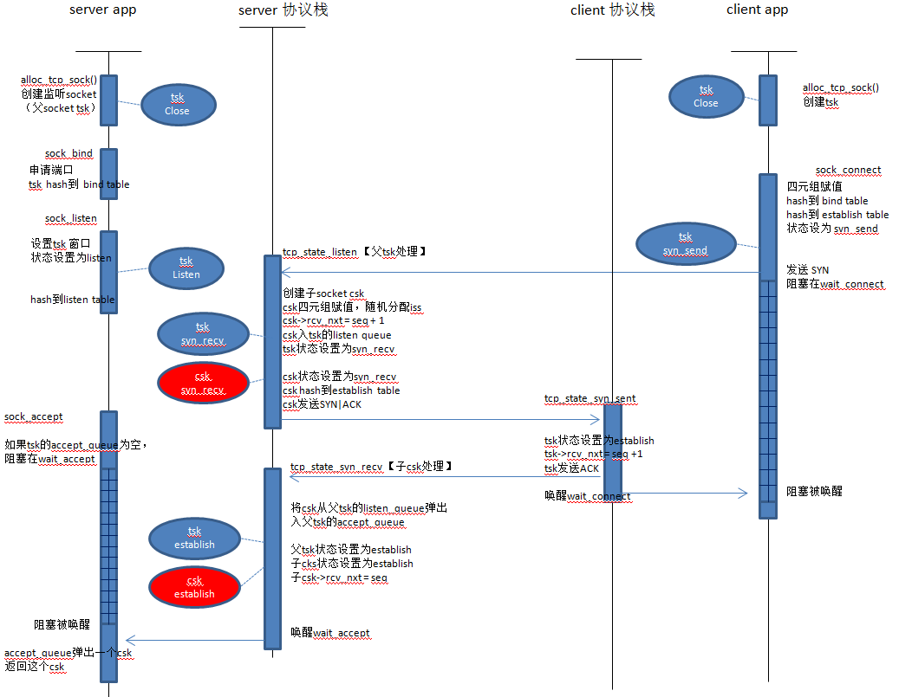
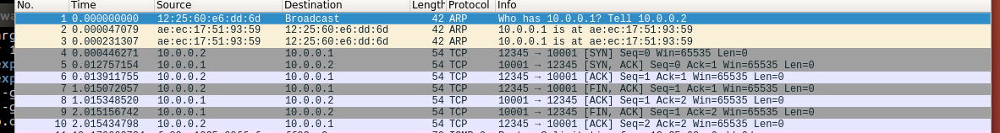
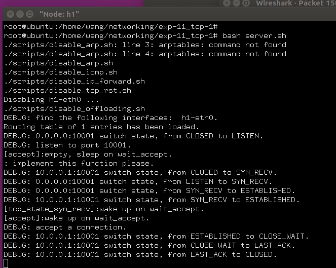
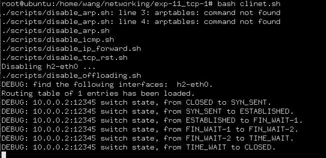

# 实验报告

姓名：王苑铮 学号：2015K8009922002
- - -
## 1.实验题目：  网络传输实验一
- - -
## 2.实验内容：
* 实现tcp状态转换、实现socket api
- - - 
## 3.实验过程
仿照uml时序图的方式画了示意图(不是标准的uml时序图)
正常状态下的连接建立过程：

断开连接时，因为不涉及sleep和wakeup，时序图比较简单，就不画了

备注：
* 刚申请的tsk是closed状态，sock_listen()把tsk设置为listen状态，以及close()会依据当前状态不同，设置到不同的关闭状态。只有这些状态转移是由socket api函数完成的，除此之外所有状态转移都是由协议栈（tcp_processing线程）完成的
* sock_accept()如果accept_queue不空(意味着之前有握手成功但还没有使用的子csk)，则不进入阻塞状态，直接从accept_queue弹出一个csk返回
- - -
## 4.实验结果
**抓包结果：**

**h1状态：**

**h2状态：**

- - -
## 5.结果分析
* 看抓包结果可知，三次握手与四次挥手都正确
* 看服务器和客户端的状态转移打印结果，状态转移正确
* 服务器、客户端都分别用自己的程序、reference互相验证，得到的都是上述结果
**结论：** tcp连接的建立与断开正确
