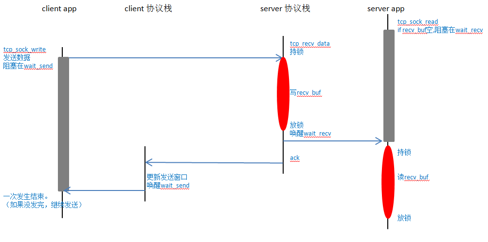
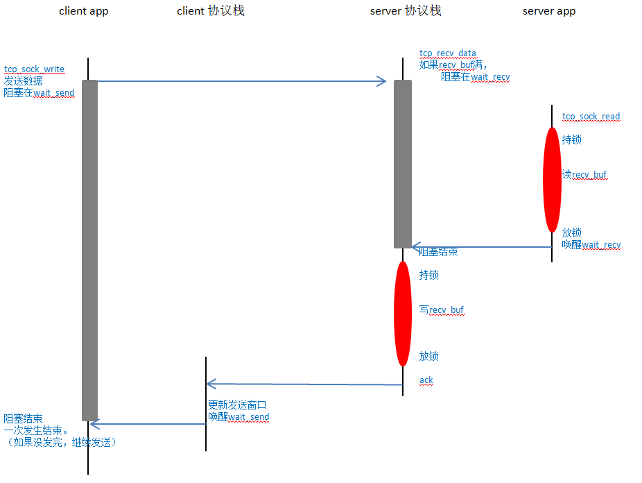
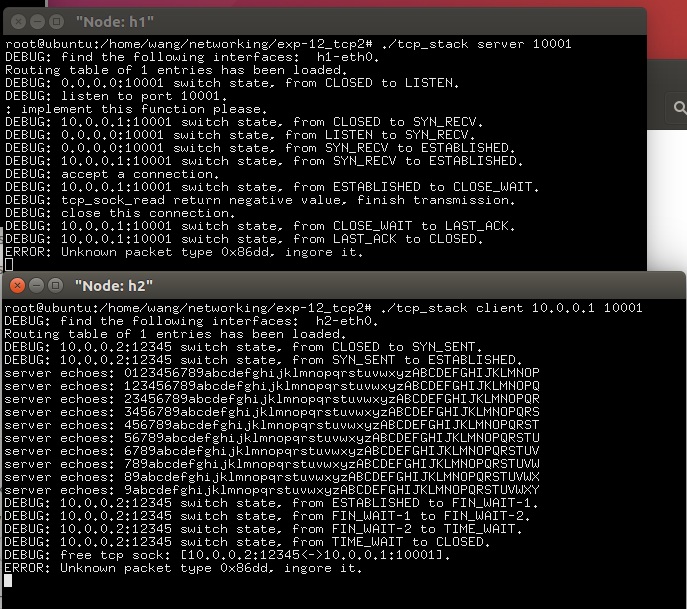

# 实验报告

姓名：王苑铮 学号：2015K8009922002
- - -
## 1.实验题目：  网络传输实验二
- - -
## 2.实验内容：
* 实现在无丢包环境下的socket 的数据收发
- - - 
## 3.实验过程
仿照uml时序图的方式画了示意图(不是标准的uml时序图)
* 如果read时数据还没发过来：

* 如果发送数据时，recv_buf缓冲区已经满了，等待read来读取：

- - -
## 4.实验结果
**结果截图：**

- - -
## 5.结果分析
* client发送给server的数据，被server正确回显了回来
* 中间加入了数据传输过程后，连接的建立与断开依然正确

结论：无丢包情况下，数据传输功能正确
