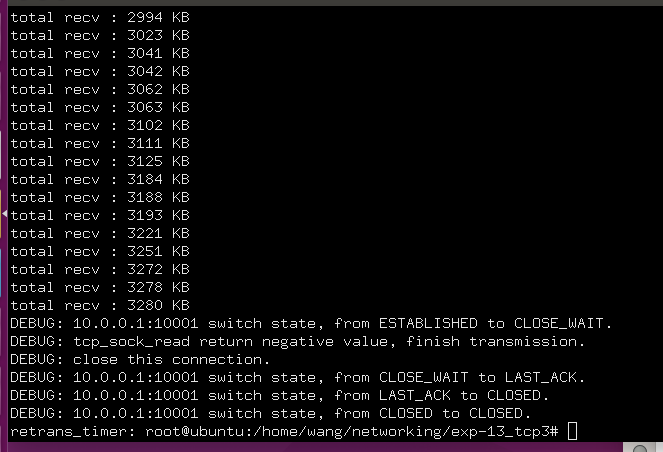
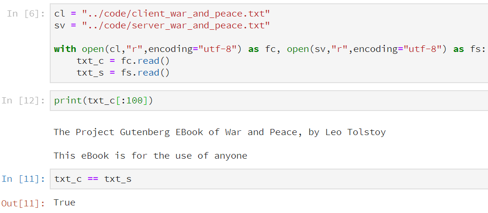
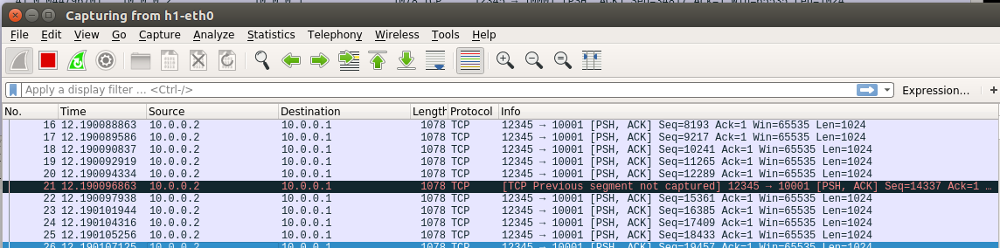
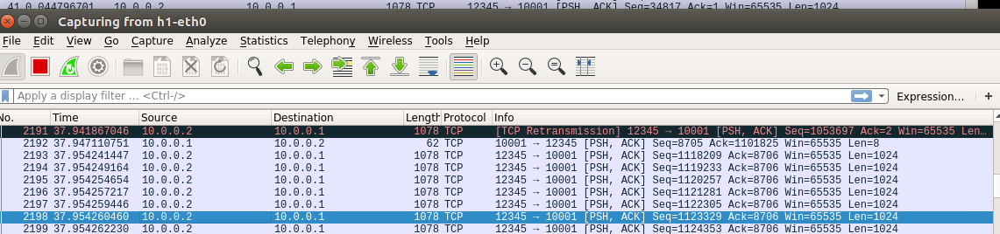

# 实验报告

姓名：王苑铮 学号：2015K8009922002
- - -
## 1.实验题目：  网络传输实验三
- - -
## 2.实验内容：
* 在有丢包的情况下，进行tcp数据包的收发
- - - 
## 3.实验过程

#### 3.1 发送缓冲区
**数据结构：**
```c
//作为全局变量的一个发送缓冲区
struct tcp_trans_buf{ 
	int size;
	pthread_mutex_t lock;
	pthread_t thread_retrans_timer;
	struct list_head list;
} trans_buf;

//每发送一个tcp包(纯ack，rst包除外)，都把这个包的一个副本缓存起来，等待确认
struct tcp_buf_block{ 
	struct list_head list;
	int len;
	char* packet;
};
```
**新添加的关于发送缓冲区的函数：**
```c
//new一个新的放在tcp发送缓冲区里的缓存块
struct tcp_buf_block* new_tcp_buf_block();
//初始化发送缓冲区
void init_tcp_trans_buf();
//释放发送缓冲区里的所有缓冲块
void buf_remove_and_free_all_block();
//重传发送缓冲区的第一个数据包
void buf_retrans_first(struct tcp_sock *tsk);
//把一个新的tcp包加入发送缓冲区的尾部
void buf_append_packet(char* packet,int len);
//对方ack后，把seq小于对端ack的tcp缓存从发送缓冲区清除
void buf_ack(struct tcp_sock *tsk, u32 ack);
```

#### 3.2 乱序接收缓冲区
**数据结构：**
```c
//用来缓存seq合法的，的数据的块
//接收缓冲区，是一个优先级队列，收到的数据包按照seq大小入队，seq越小，离队头越近
//注意。“接收缓冲区”和“读缓冲区”是不一样的。
//“接收缓冲区”用来缓存乱序到达或者有丢包的tcp数据，
//有序的tcp数据放在“读缓冲区”里，等待tcp_sock_read来读取
struct tcp_ofo_block {
	struct list_head list;
	u32 seq;
	u32 len; //数据部分的长度，不是包的长度
	char* data; //只保存tcp包的数据部分
};
```
**新添加的关于发送缓冲区的函数：**
```c
//每收到一个seq在recv_nxt与最大接收窗口之间的数据包，无论是否乱序，都把它先放进接收缓冲区。
//缓冲区是优先级队列，乱序到达的包，在队列里会变成有序的
void ofo_packet_enqueue(struct tcp_sock *tsk, struct tcp_cb *cb, char *packet);
//从当前recv_nxt开始，将连续确认的最长数据写入“读缓冲区”。如果读缓冲区满了，则先阻塞在wait_recv
int ofo_packet_dequeue(struct tcp_sock *tsk);
```

#### 3.3超时重传计时器
```c
//启动用来tcp重传的计时器tcp_retrans timer
void tcp_set_retrans_timewait_timer(struct tcp_sock *tsk);
//计时器重设为初始的默认值
void tcp_update_retrans_timewait_timer(struct tcp_sock *tsk);
//停用计时器
void tcp_stop_retrans_timewait_timer(struct tcp_sock *tsk);
//计时器的定时扫描函数以及扫描线程
void tcp_scan_retrans_timer_list();
void *tcp_retrans_timer_thread(void *arg);
```

#### 3.4 对原有的数据结构的修改：
```c
//额外添加了两个域
struct tcp_sock {
    .....
    struct tcp_timer retrans_timer; //新增的域：类似于struct tcp_timer retrans_timer;但这个是用来tcp重传计时的
    .....
    struct list_head rcv_ofo_list; //乱序到达的包的缓存队列
    .....
};


//额外添加了一个域
struct tcp_timer {
	int type;
	int timeout;
	int retrans_times; //新添加的域：重传次数
	struct list_head list;
};
```

#### 3.5 对原有函数的修改：
```c
void tcp_send_packet(struct tcp_sock *tsk, char *packet, int len) 
{
    ......
    /////////////////////////////////////////////////
    //发送新的数据时
    //放到snd_buffer队尾
    buf_append_packet(packet, len); //里面有计算buf的size
    //打开定时器
    tcp_update_retrans_timewait_timer(tsk);
    /////////////////////////////////////////////////
    ip_send_packet(packet, len);
}

void tcp_send_control_packet(struct tcp_sock *tsk, u8 flags)
{
	......
	/////////////////////////////////////////////////////////
	if((flags != TCP_ACK) && ((flags & TCP_RST)==0) ){ //ack包不缓存
		//控制包有序列号，但没有数据，所以不增加buf的size
		//新的包放入队尾
		buf_append_packet(packet, pkt_size);
		//打开定时器
		tcp_update_retrans_timewait_timer(tsk);
	}
	/////////////////////////////////////////////////////////
	ip_send_packet(packet, pkt_size);
}

//修改后的tcp_sock_write:
//1.需要开启/关闭重传计时器。
//2.发完数据后、发送缓冲区没确认完之前需要先阻塞
int tcp_sock_write(struct tcp_sock *tsk, char *buf, int len){
    int remain_len = len; //剩余未发送长度
    int offset = 0;
    tcp_set_retrans_timewait_timer(tsk); //打开重传计时器
    //发送数据
    while(remain_len>0){
        //int send_len = min(remain_len, MAX_TCP_DATA_LEN);
        int send_len = min(remain_len, NORMAL_TCP_DATA_LEN);
        while(trans_buf.size + send_len > tsk->snd_wnd){ //超过容量，先等待
            if(sleep_on(tsk->wait_send)<0){
                tcp_stop_retrans_timewait_timer(tsk);
                return -1;
            }
        }
        tcp_send_data(tsk, buf+offset, send_len );
        offset     += send_len;
        remain_len -= send_len;
    }
    while(trans_buf.size>0){ //还有剩余的数据未被ack
        if(sleep_on(tsk->wait_send)<0)
        	return -1;
    }
    tcp_stop_retrans_timewait_timer(tsk); //关闭重传计时器
    return 0;
}

//新的数据接收流程
//确认数据时，不使用ack包确认，因为纯ack包不占序列号
//用tcp包发一个我自定义的"666-get"数据报来确认数据
//"666-get"相当于我自定义的一个socket应用层协议。
//实际可能需要通过转义等方式避免文本中也有"666-get"这种字段。我简化了没有处理
void tcp_recv_data(struct tcp_sock *tsk, struct tcp_cb *cb, char *packet){
	if(less_than_32b(cb->seq, tsk->rcv_nxt)){
		return;
	}
	ofo_packet_enqueue(tsk, cb, packet); //with free inside it
	ofo_packet_dequeue(tsk); //里面会重设recv_nxt
	tsk->snd_una = (greater_than_32b(cb->ack, tsk->snd_una))?cb->ack :tsk->snd_una;
	//tcp_send_control_packet(tsk, TCP_ACK);
	tcp_set_retrans_timewait_timer(tsk);
	tcp_send_data(tsk, "666-get",sizeof("666-get"));
}

//tcp_sock_read不在乎对端发来的数据有多长，只管从rcv_buf里拿数据。
//上层使用时是把tcp_sock_read放在一个while(1)循环里
//如果对端的write数据都发完了，read在无法继续受到数据时会阻塞。
//直到对端close时，本机处理对端的fin时会强制唤醒睡眠中的read。
//通过检查read的返回值可以知道是对端close了，于是从while(1)循环里跳出来1
int tcp_sock_read(struct tcp_sock *tsk, char *buf, int len){
	static int times = 0;
	while( ring_buffer_empty(tsk->rcv_buf) ){
		if( sleep_on(tsk->wait_recv)<0 ){
			tcp_stop_retrans_timewait_timer(tsk);
			return -1;
		}
	}
	int rlen = read_ring_buffer(tsk->rcv_buf, buf, len); //with mutex inside it
	wake_up(tsk->wait_recv);
	tcp_stop_retrans_timewait_timer(tsk);
	return rlen;
}
```
主要进行了以上修改。其余还有些比较细碎的修改想不起来了
- - -
## 4.实验结果
**结果截图：**
**实验结果：** 

用python对比了收发的文件，发现两分文档内容是一致的，我的程序达到了预期功能

**wireshark抓包分析：**
这个是server收到的数据中的丢包现象

这个是client没有被确认的包的超时重传

另外还可以看到，收到这个重传包后，server确认了这个包以及之后连续的一段数据，ack了最长的一段连续数据
连接建立以及关闭过程的丢包、重传的图没截，但也是正确连接的
- - -
## 5.结果分析
* 在丢包的情况下，client正确重传了没有被server确认的数据包
* 在有丢包，以及有包乱序到达的情况下，server正确的按序接收了client发来的数据
* write发出的数据和read读到的数据是一致的
* 在控制包发生丢失的情况下，依然能正确重传控制包，正确建立/断开连接

结论：在丢包状态下，依然能完成tcp协议的传输功能
