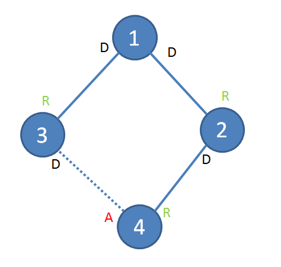
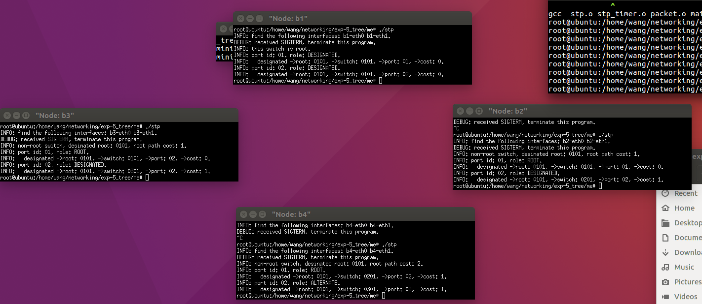
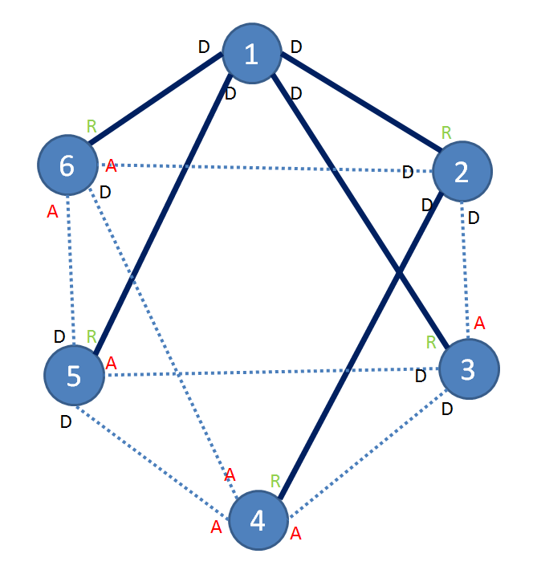
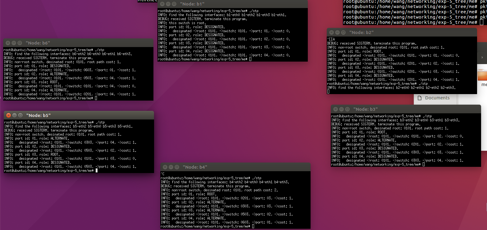
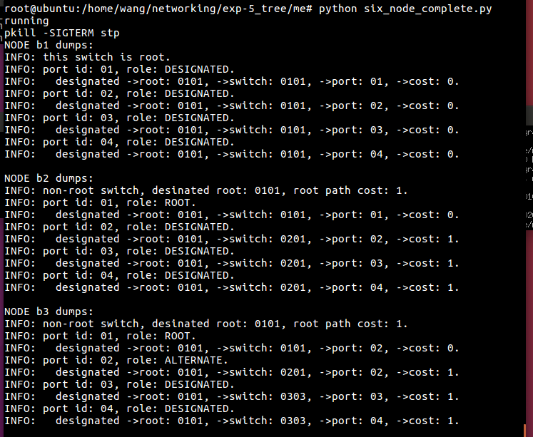
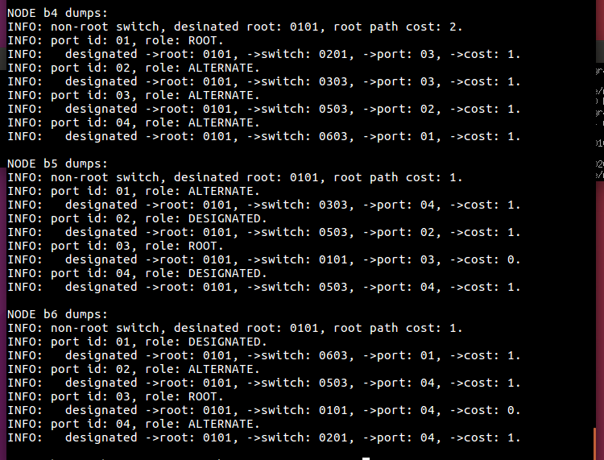

# 实验报告

姓名：王苑铮 学号：2015K8009922002
- - -
## 1.实验题目：  生成树机制实验
- - -
## 2.实验内容：
* 实现交换机的生成树算法
	* 节点的端口收到config，比较收到的config与本地config的优先级
    * 收到的config优先级高：
	  * 用收到的config更新port的信息（从而把指定端口变为非指定端口）
	  * 更新节点：从该节点的所有非指定端口中，找到优先级最高的作为根端口。并依据根节点的信息更新节点上所有的指定、非指定端口的信息
	  * 关闭节点的主动定时config发送功能
	  * 将更新后的端口信息用config从各个指定端口转发出去
	* 收到的config优先级低：
	  * 继续向外发送本端口的config
* 在不同的拓扑上运行生成树算法，检查生成的网络拓扑结构
- - - 
## 3.实验过程
**收到config后的处理过程（算法的主要逻辑）** 
```c
static void stp_handle_config_packet(stp_t *stp, stp_port_t *p,
		struct stp_config *config)
{
	// TODO: handle config packet here
	//fprintf(stdout, "TODO: handle config packet here.\n");
	//因为调用该函数的外层函数已经加锁了，所以此处不用再加锁
	if(config_cmp_port_msg(p,config)<0 ){
		int used_to_be_root = stp_is_root_switch(stp);
		undesigned_port(p,config);
		stp_update(stp,config);
		if(used_to_be_root)
			stp_stop_timer(&stp->hello_timer);
		stp_send_config(stp); //不知道是否需要
	}
	else{
		stp_port_send_config(p);
	}
}
```
**各种优先级的比较：port与config，port与port，port与stp**
```c
int config_cmp_port_port(stp_port_t *p1,stp_port_t *p2){

	u64 p1_root = p1->designated_root,
		p2_root = p2->designated_root;
	u32 p1_cost = p1->designated_cost,
		p2_cost = p2->designated_cost;
	u64 p1_switch = get_switch_id(p1->designated_switch),
		p2_switch = get_switch_id(p2->designated_switch);
	u16 p1_port = get_port_id(p1->designated_port),
		p2_port = get_port_id(p2->designated_port);


	if(p1_root != p2_root)
		return (p1_root < p2_root)?1:-1;
	else if(p1_cost != p2_cost)
		return (p1_cost < p2_cost)?1:-1;
	else if(p1_switch != p2_switch)
		return (p1_switch < p2_switch)?1:-1;
	else if(p1_port != p2_port)
		return (p1_port < p2_port)?1:-1;
	else
		return 0;
}

int config_cmp_port_msg(stp_port_t *p1,struct stp_config *config){
	u64 config_root_id = ntohll(config->root_id);
	u32 config_root_path_cost = ntohl(config->root_path_cost);
	u64 config_switch_id = get_switch_id(ntohll(config->switch_id));
	u16 config_port_id = get_port_id(ntohs(config->port_id));

	u64 p1_root = p1->designated_root;
	u32 p1_cost = p1->designated_cost;
	u64 p1_switch = get_switch_id(p1->designated_switch);
	u16 p1_port = get_port_id(p1->designated_port);

	if(p1_root != config_root_id)
		return (p1_root < config_root_id)?1:-1;
	else if(p1_cost != config_root_path_cost)
		return (p1_cost < config_root_path_cost)?1:-1;
	else if(p1_switch != config_switch_id)
		return (p1_switch < config_switch_id)?1:-1;
	else if(p1_port != config_port_id)
		return (p1_port < config_port_id)?1:-1;
	else
		return 0;
}


int config_cmp_port_stp(stp_port_t *p1,stp_t *stp){
	u64 stp_root_id = stp->designated_root;
	u32 stp_root_path_cost = stp->root_path_cost;
	u64 stp_switch_id = get_switch_id(stp->switch_id);
	u16 stp_port_id = get_port_id(p1->port_id);

	u64 p1_root = p1->designated_root;
	u32 p1_cost = p1->designated_cost;
	u64 p1_switch = get_switch_id(p1->designated_switch);
	u16 p1_port = get_port_id(p1->designated_port);

	if(p1_root != stp_root_id)
		return (p1_root < stp_root_id)?1:-1;
	else if(p1_cost != stp_root_path_cost)
		return (p1_cost < stp_root_path_cost)?1:-1;
	else if(p1_switch != stp_switch_id)
		return (p1_switch < stp_switch_id)?1:-1;
	else if(p1_port != stp_port_id)
		return (p1_port < stp_port_id)?1:-1;
	else
		return 0;
}

```
**把指定端口变为非指定端口**
```c
void undesigned_port(stp_port_t *p,struct stp_config *config){
	p->designated_root   = ntohll(config->root_id);
	p->designated_cost   = ntohl(config->root_path_cost);
	p->designated_switch = ntohll(config->switch_id);
	p->designated_port   = ntohs(config->port_id);
}
```
**节点收到优先级更高的config时，更新节点状态以及各个port**
```c
static void stp_update(stp_t *stp, struct stp_config *config){
	stp->root_port = NULL;
	stp_port_t *max_port = &stp->ports[0];
	
	//找到优先级最高非指定端口
	for(int i=0; i<stp->nports ; ++i){
		if(		(stp->root_port!=NULL && !stp_port_is_designated(&stp->ports[i]) && config_cmp_port_port(&stp->ports[i],stp->root_port) >0) \
			||  (stp->root_port==NULL && !stp_port_is_designated(&stp->ports[i])) )
			stp->root_port = &stp->ports[i];
	}

	if(stp->root_port == NULL){ //意味着是根节点
		stp->designated_root = stp->switch_id;
		stp->root_path_cost  = 0;
	}
	else{
		stp->designated_root = stp->root_port->designated_root;
		stp->root_path_cost  = stp->root_port->designated_cost + stp->root_port->path_cost;
	}
	//更新port状态
	
	for(int i=0; i<stp->nports ; ++i){
		if(stp_port_is_designated(&stp->ports[i])){
			stp->ports[i].designated_root = stp->designated_root;
			stp->ports[i].designated_cost = stp->root_path_cost;
		}
		
		else if(config_cmp_port_stp(&stp->ports[i],stp)<0){
			stp_port_t *p=&stp->ports[i];
			p->designated_root = stp->designated_root;
			p->designated_cost = stp->root_path_cost ;
			p->designated_switch = stp->switch_id;
			p->designated_port = p->port_id;
		}
		
	}
	
}

```
- - -
## 4.实验结果
**4个switch**
拓扑：

结果：

dump：


**6个switch**
拓扑：

结果：

dump:



- - -
## 5.结果分析
**现象：**
生成的结果与图上画的相同，结果正确
最小的switch 1 是根节点，上面的都是根端口
其余switch上，都有且只有一个根端口。这个根端口是离根节点最近的端口，用来向根节点收发包。还有一些指定端口，它们的作用是向原理根节点的节点收发包的。剩下的端口是被禁用的端口。禁用掉一些端口后，拓扑中的一些边就没有了，剩下的拓扑没有环路，是一颗生成树。
**结论：**
生成树算法确实可以从逻辑上避免途中的环路，从而避免广播风暴
- - -
## 6.调试过程
**现象1：** 4节点是拓扑，生成的结果很混乱，端口的状态和预期的不一致
**原因：** 没有注意到通过网络发送的config与端口本地的config的大小端不同。一开始没进行大小端转换直接比较的，所以错了。做了大小端转换后，结果就对了

**现象2：** 6节点拓扑，以不同顺序启动./stp，生成的结果不一样
**原因：** 最初版本的ppt里，非指定端口不能转换为指定端口，所以类似于形如 1-3-2 这样的拓扑结构，23先通信与13先通信，会产生不一样的结果。如果23先通信，3认为2是根节点，于是3通往2的port被认为是非指定端口。然后13通信，3发现1优先级更高，将1作为根节点，但是3通往2的节点被禁掉了，无法发消息通知给2，2被孤立
而如果是13先通信，23后通信，则可以正常的建立起1-3-2的通路。这样，在不同的启动顺序下，可能会产生不同的生成树结果。
后来，在加上把非指定端口变为指定端口的对应规则后，这个问题就解决了，得到的一定是唯一的生成树，并且不会产生有节点被孤立的情况
