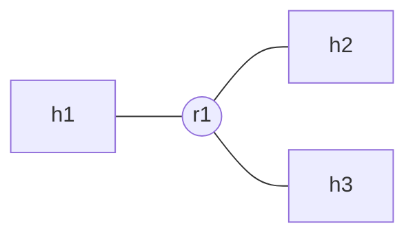
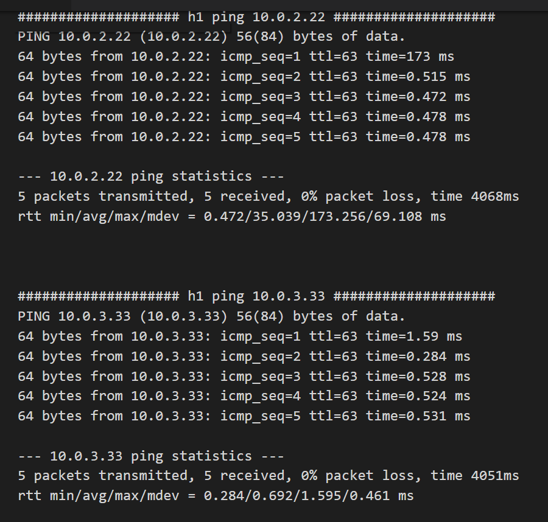
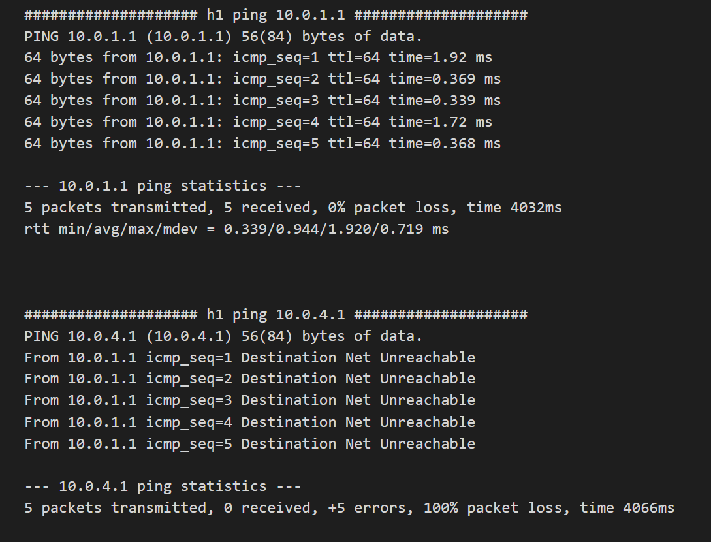
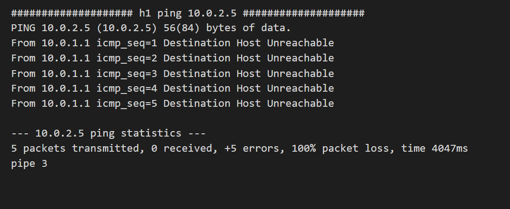
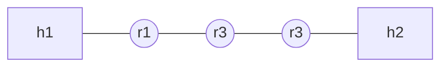
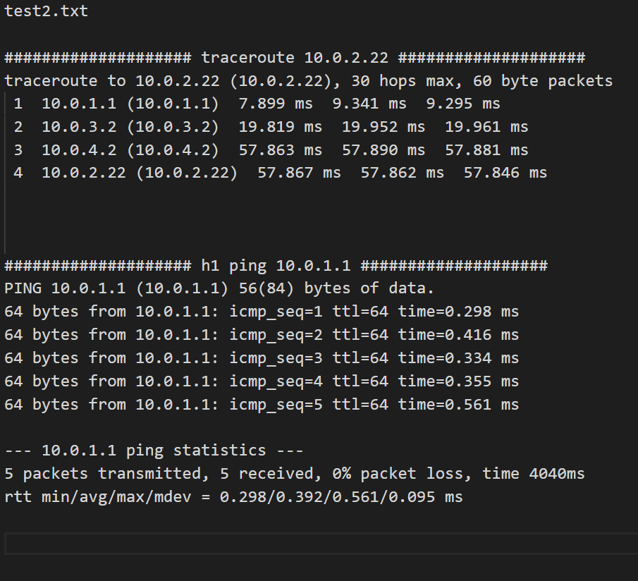
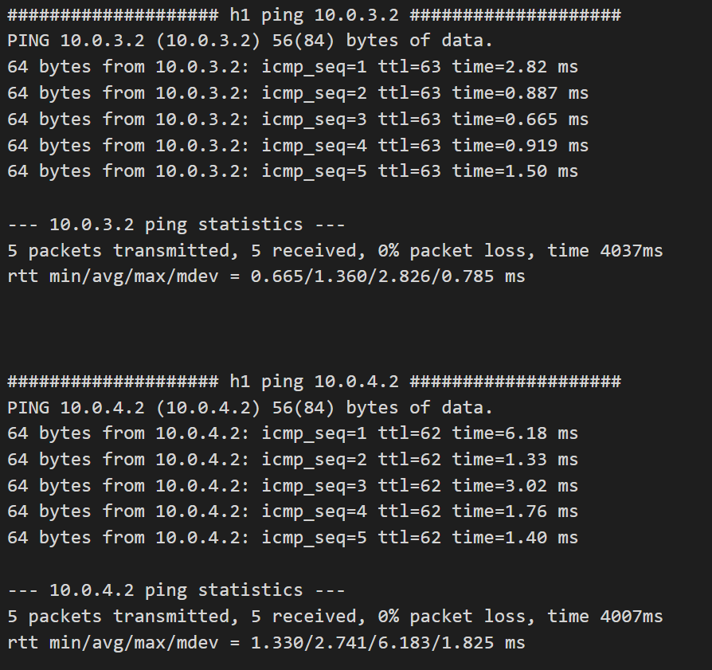
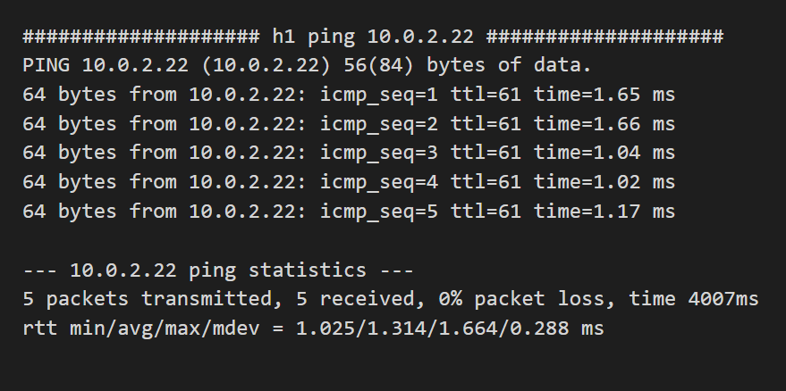

# 实验报告

姓名：王苑铮 学号：2015K8009922002
- - -
## 1.实验题目：  路由转发实验
- - -
## 2.实验内容：
* arp:发送、接收arp request，arp reply
* arpcache:
  * arpcache_lookup：查询arpcache中是否有需要的ip->mac映射
  * arp_insert：收到arp reply后，把对应的ip->mac插入到arpcache的ip->mac映射表中，并查找缓存packet序列把这个ip下的缓存packet都发送出
  * arp_append_packet：需要转发packet但是没有对应的ip->mac映射项，则先把此packet缓存到对应的ip下面。如果之前没有此ip的缓存序列则需要创建
  * arp_sweep：一个单独的线程，每一秒启动一次，将arpcache缓存的ip序列下的每一个ip发一个arp请求。如果有某个ip超过了发arp request的上限，则删除此ip的packet缓存序列，并对每个packet发icmp HOST_UNREACH错误
* icmp:组织icmp包(有ping的reply，路由表查不到表项的NET_UNREACH,在arpcache中发送超过arp request数量上限而未收到arp reply的HOST_UNEACH,转发次数超过上限TTL<0)并发送出去
* ip:
  * longest_prefix_match:在ip表中进行最长匹配找到对应的网络
  * handle_ip_packet:收到ip包后，如果是ping包则返回icmp的ping应答，否则转发
  * ip_forward_packet:处理收到的ip包。如果路由表能最长匹配到对应的端口则转发出去，否则丢弃packet并发回icmp NET_UNREACH
* 学会手动配置路由表
- - - 
## 3.实验过程
这次的代码太长了，就不把源码贴在这里了，code文件夹里都有。分析一下实验的代码流程和数据结构，并结合几次实验理解一下理论课的一些知识
### 3.1 不同包的结构和功能
**收到ip包可以转发、回应；收到arp包可以回应或丢弃，而不会转发arp包**
   

### 3.2 arpcache
   

### 3.3 线程-函数-包-数据结构之间的包含、调用、操作关系

### 3.4 三种表的对比：转发表、路由表、arpcache表
对比 | 转发表 | 路由表 | arpcache表 
 :-    | :-        | :-     | :-
拥有者| 交换机 | 路由器 | 路由器
数据结构|  hash表(用链表解决冲突) | 链表 | 数组
表项的映射|目的mac->发包iface | 目的ip->发包iface | 目的ip->下一跳mac
表项获取方式| 学习 | 手动配置 | arp请求、应答
表项是否老化| 老化 | 固定 | 老化
表的网络层级| 链路 | ip   | 链路-ip两层的媒介
### 3.5 四种设备的对比：集线器、网桥/交换机、路由器
对比 | 集线器 | 网桥/交换机 | 路由器
:- | :- | :- | :-
层级|物理|链路|ip
各端口是否处于相同碰撞域|是|否|否
各端口是否处于相同广播域| |是|否
*备注|共享一根线的带宽|网桥双端口，交换机多端口|

- - -
## 4.实验结果
### 拓扑1

结果：

### 拓扑2

结果：

- - -
## 5.结果分析
### 实验一
h1 ping 10.0.2.22,10.0.3.33可以ping通，说明路由器正确连通了多个局域网
h1 ping 10.0.4.1 回复net unreach，说明路由器里没有此网段的路由表项，目的网段不可达
h1 ping 10.0.2.5，回复host unreach，说明路由器有此网段的路由表项，但是发出arp请求后一直无法收到arp回应，目的主机不可达
### 实验二
h1 traceroute h2，正确显示了沿途的ip端口。
h1 ping traceroute显示的沿途端口能够ping通。
说明路由器ip配置正确，并且多跳路由器正确连通了两个局域网