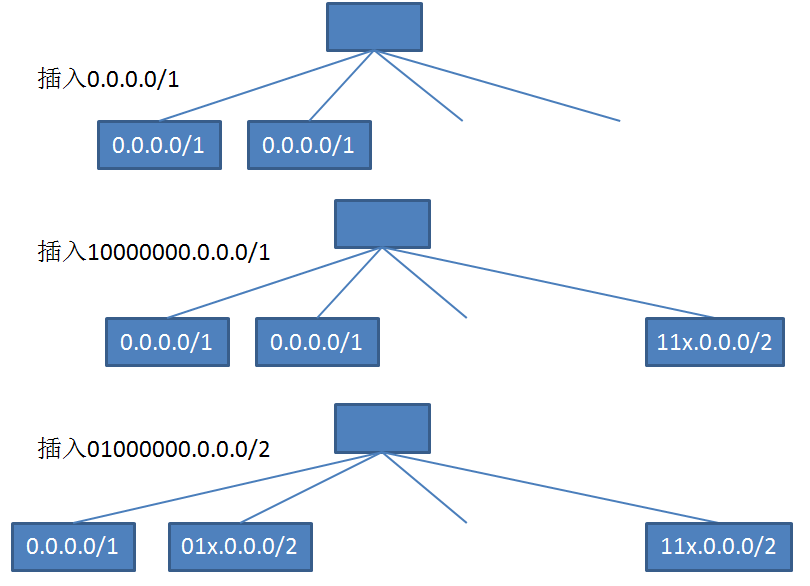
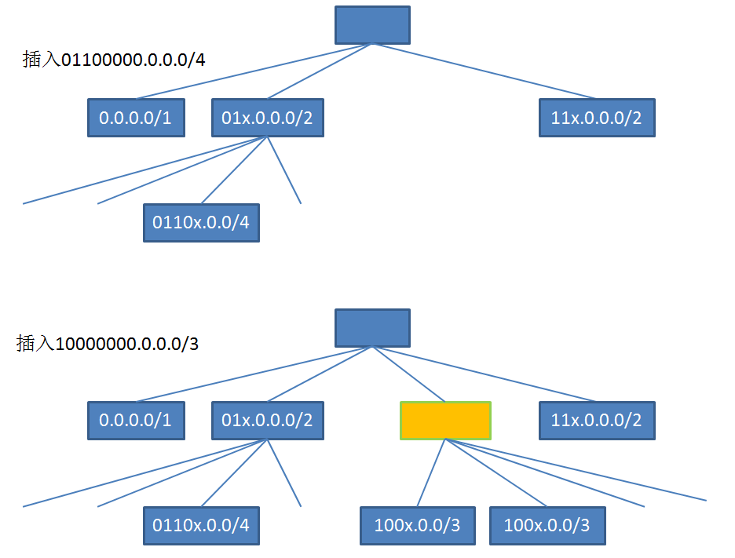
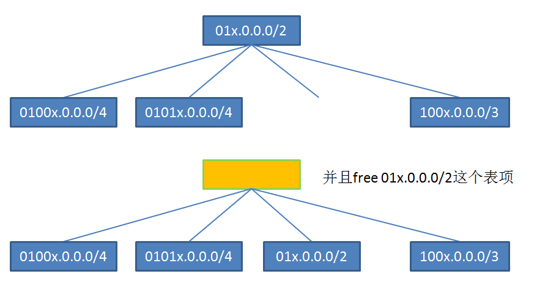
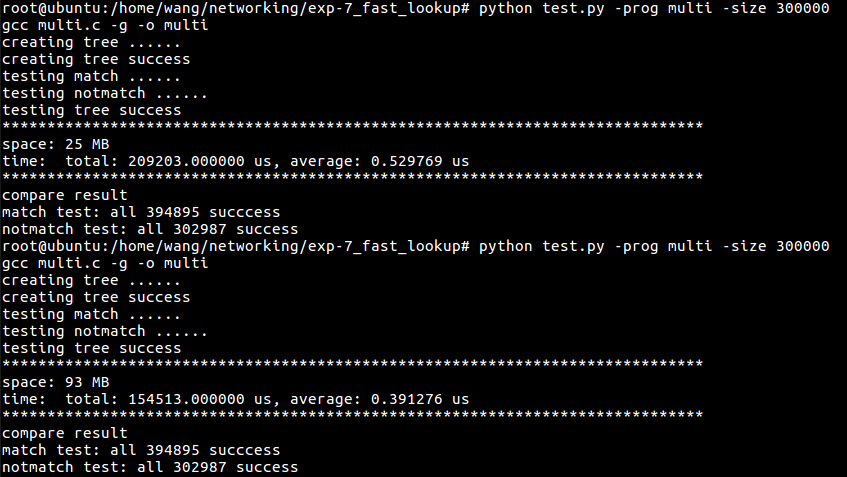
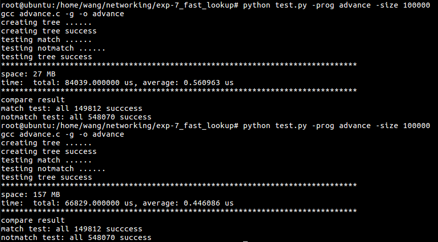

# 实验报告

姓名：王苑铮 学号：2015K8009922002
- - -
## 1.实验题目：  高效路由查找
- - -
## 2.实验内容：
* 基本的二叉前缀树
* 多比特前缀树
* 多比特前缀树+叶推
- - - 
## 3.实验过程
单比特树的原理比较简单，就不展示了
#### 多比特树的构造演示：

#### 叶推演示(代码用递归实现)：
(1)将0100000000.0.0.0/2推下去：

(2)一个父叶子的所有子节点都已经有路由表项了：将此父节点的路由表项删去

(3)父节点把自己的路由表项推给孩子节点。如果孩子节点为空(没有此节点，而不是有节点无表项)，则把父节点的表项创建一个叶子。如果孩子节点有节点有自己的表项，则向下叶推孩子节点的表项

(4)父节点把自己的路由表项推给孩子节点。如果孩子节点只有节点而没有表项，则继续把父节点的表项推下去

- - -
## 4.实验结果
#### 测试方法：
* 由data.py脚本产生测试数据：从forward-table.txt的600000多条路由表项中，随机取出300000条表项作为子表subtable，提供给c语言产生路由表。从forward-table的每个路由表项中，每一个表项的网段里随机产生一个ip地址。按照是否能匹配到subtable里，分成match，notmatch两组，分别存入match_i.txt,notmatch.txt里
* 由auto.py脚本进行测试。运行c语言的查找树，输入match_i.txt，将匹配成功的ip地址输出到match_o.txt。输入notmatch_i.txt，将匹配成功的ip地址输出到notmatch_o.txt。然后python读入match_i.txt,matco_o.txt,notmatch_i.txt,notmatch_o.txt。如果match_i.txt,matco_o.txt内容相同，则所有应该匹配到的IP地址都匹配到了；如果notmatch_o.txt为空，则所有不应该匹配到的ip地址都没匹配到
* c语言中统计了查找树所占用的总内存，以及匹配ip所需要的总时间和每条ip的平均时间

#### 测试结果：

无叶推，2bit树,300000条表项：总内存25 MB，平均用时0.529769 us
无叶推，4bit树,300000条表项：总内存93 MB，平均用时0.391276 us

叶推，2bit树,100000条表项：总内存27 MB，平均用时0.560963 us
叶推，4bit树,100000条表项：总内存157 MB，平均用时0.446086 us

- - -
## 5.结果分析
* 多bit树可以提升查找速度，但也会显著提升所需空间
* 叶推对查找速度的提升不明显，并且会增加内存占用。但考虑到叶推后数据排列的更紧密，路由器采用比较高效的cache或许可以减少访存延迟